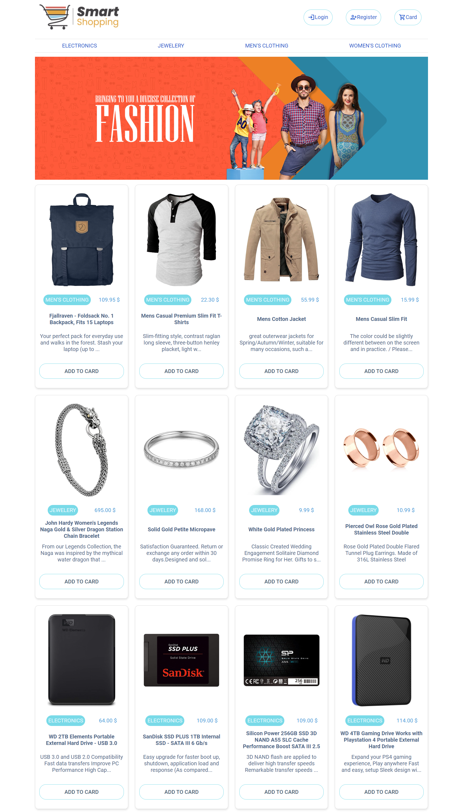
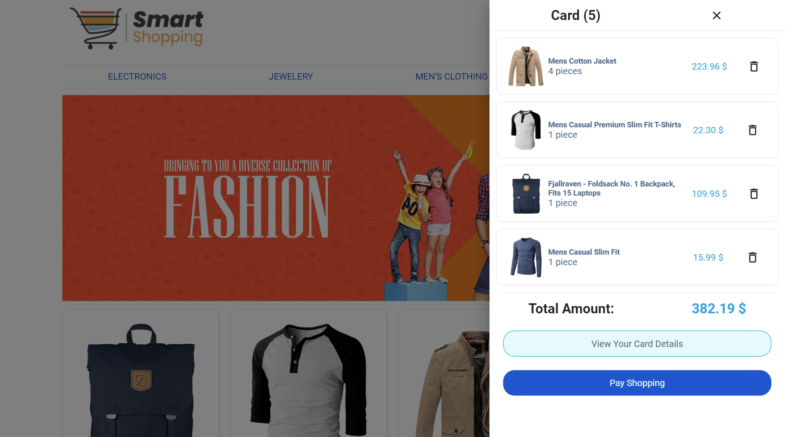
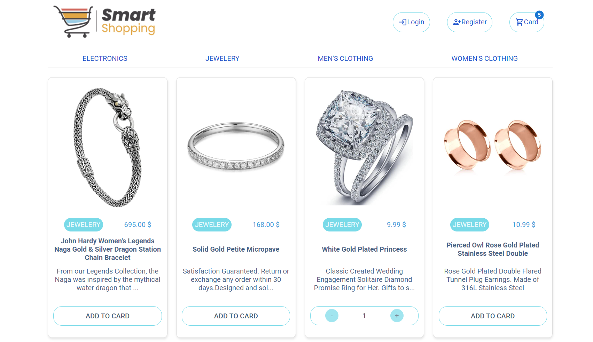
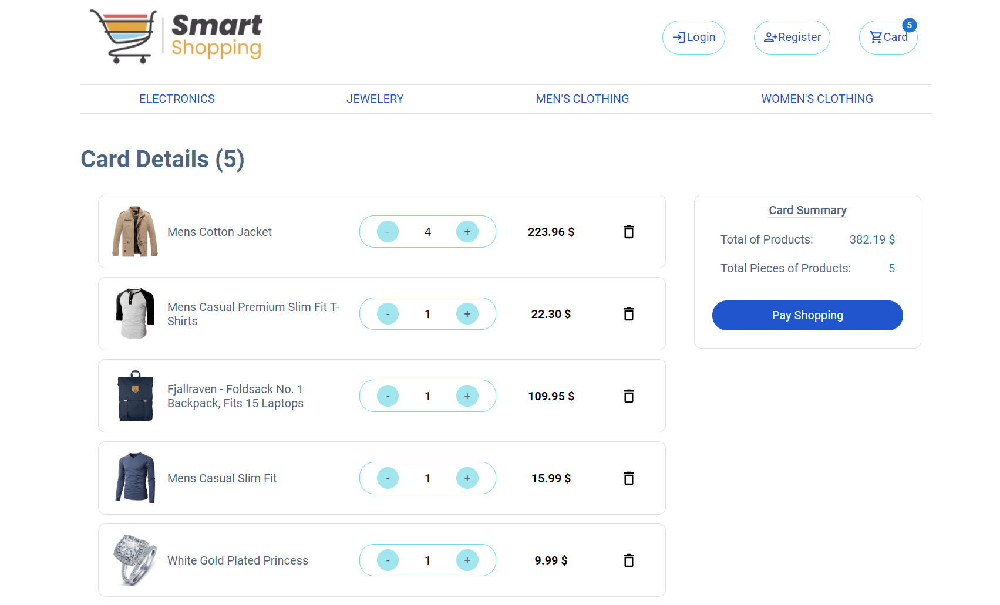

It's e-commerce app built with React.

 
## Content

- [Introduction](#introduction)
- [Technologies Used](#technologies-used)
- [Installation](#installation)
- [Previews](#previews)
- [To Do](#todo)

<br>

# Introduction

- You can list your products and its descriptions with price
- This project has own grid system like Tailwind an Bootstrap. You can create new responsive design by changing class name
- You can edit all colors in sass and add new one.
- Used FakeStoreApi in this app
- The app developed for both web and mobile. All pages have responsive UI.

<br>

## Technologies Used

- ReactJS
- React Router
- Redux
- SASS
- Axios
- Gulp
- MUI
- Fake Store API

<br>

## Installation

- First, clone the project:

```sh
git clone https://github.com/yigitden/e-commerce-react-redux.git
```

- Then, start the project on localhost:

```bash
# install dependencies with npm
npm install
# or install dependencies with yarn
yarn

# serve at localhost:3000
npm start
pmark
```
 
<br>
<br>

# Previews

<center>

## Web - Main Page



## Web - Card Drawer



## Web - Category Page

 

## Web - Card Summary

 
 

# Todo

- Footer
- Register-Login Page
- Payment Page 
- Product Detail Page